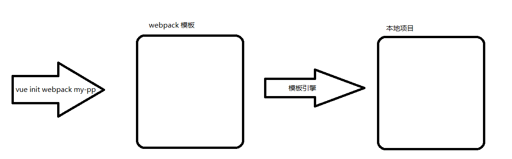

# 揭秘 Vue CLI，打造属于自己的项目脚手架工具

- vue-cli
- create-react-app
- gulp
- webpack
- yeoman
- express-generator
- ...

为什么需要脚手架？

- 减少重复性的工作，不再需要复制其他项目再删除无关代码，或者从零创建一个项目和文件。
- 根据交互动态生成项目结构和配置文件等。
- 多人协作更为方便，不需要把文件传来传去。


```bash
npm install --global vue-cli

```


## 实现思路



- 项目模板放在 github 上
- 用户通过命令交互的方式下载不同的模板
- 经过模板引擎渲染定制项目模板
- 模板变动，只需更新模板即可，不需要用户更新脚手架

## 涉及知识点及模块

- [NodeJS](https://nodejs.org/en/)
  - 基于Node.js开发命令行工具
- [ECMAScript 6](http://es6.ruanyifeng.com/)
  - 使用最新版本语言进行开发
- [npm](http://npmjs.com/) 发包
  - npm 包的发布及更新流程

- [commander.js](https://github.com/tj/commander.js)
  - 可以自动的解析命令和参数，用于处理用户输入的命令。
- [download-git-repo](https://github.com/flipxfx/download-git-repo)
  - 下载并提取 git 仓库，用于下载项目模板
- [Inquirer.js](https://github.com/SBoudrias/Inquirer.js)
  - 通用的命令行用户界面集合，用于和用户进行交互 
- [handlebars.js](https://github.com/wycats/handlebars.js)
  - 模板引擎，将用户提交的信息动态填充到文件中
- [ora](https://github.com/sindresorhus/ora)
  - 下载过程久的话，可以用于显示下载中的动画效果 
- [chalk](https://github.com/chalk/chalk)
  - 可以给终端的字体加上颜色 
- [log-symbols](https://github.com/sindresorhus/log-symbols)
  - 可以在终端上显示出 √ 或 × 等的图标

## 初始化

```bash
mkdir itcast-cli
cd itcast-cli
npm init -y
```

新建 `index.js` 并写入以下内容：

```javascript
#!/usr/bin/env node

console.log('hello itcast-cli')

```

配置 `package.json` 中的 `bin` 字段：

```
{
  "name": "demo",
  "version": "1.0.0",
  "description": "",
  "main": "index.js",
  "scripts": {
    "test": "echo \"Error: no test specified\" && exit 1"
  },
  "keywords": [],
  "author": "",
  "license": "ISC",
  "bin": {
    "itcast": "index.js"
  }
}

```

执行 `npm link` 链接命令到全局。

执行 `bin` 中配置的命令测试。

例如这里：

```bash
itcast
```

输出如下：

```
hello demo
```

## 命令行工具参数设计

```
itcast -h|--help	查看使用帮助
itcast -V|--version 查看工具的版本号
itcast list 列出所有可用模板
itcast init <template-name> <project-name> 基于指定的模板进行项目初始化
```

## 使用 commander 模块处理命令行

安装：

```bash
npm install commander
```

```javascript
#!/usr/bin/env node
const program = require('commander')

program.version('1.0.0', '-v, --version')
	.command('init <name>')
	.action((name) => {
		console.log(name);
	});

program.parse(process.argv);
```

- 调用 version('1.0.0', '-v, --version') 会将 -v 和 –version 添加到命令中，可以通过这些选项打印出版本号 
- 调用 command('init <name>') 定义 init 命令，name 则是必传的参数，为项目名
- action() 则是执行 init 命令会发生的行为，要生成项目的过程就是在这里面执行的，这里暂时只打印出 name 

输入以下命令进行测试；

```
demo --help
demo -V
```

## 下载模板

安装：

```bash
npm install download-git-repo
```

修改代码：

```javascript
const program = require('commander')
const download = require('download-git-repo')

program
  .version('1.0.0')

program
  .command('init <name>')
  .description('generate a new project from a template')
  .action((name) => {
    download('http://xxxxxx:9999:HTML5/H5Template#master', name, { clone: true }, (err) => {
      console.log(err ? 'Error' : 'Success')
    })
  })

program.parse(process.argv)

```


- download() 第一个参数就是仓库地址
  - 端口号后面的 ‘/‘ 在参数中要写成 ‘:’ 
  - #master 代表的就是分支名 
    - 不同的模板可以放在不同的分支中，更改分支便可以实现下载不同的模板文件了 
- 第二个参数是路径
  - 上面我们直接在当前路径下创建一个 name 的文件夹存放模板，也可以使用二级目录比如 test/${name} 

## 命令行交互

安装：

```bash
npm install inquirer
```


命令行交互功能可以在用户执行 init 命令后，向用户提出问题，接收用户的输入并作出相应的处理。这里使用 inquirer.js 来实现。 

```javascript
const inquirer = require('inquirer')

inquirer.prompt([{
  type: 'input',
  name: 'author',
  message: '请输入作者名称'
}]).then((answers) => {
  console.log(answers.author)
})
```

- 问题就放在 prompt() 中 
- 问题的类型为 input 就是输入类型 
- name 就是作为答案对象中的 key 
- message 就是问题了 
- 用户输入的答案就在 answers 中 

## 渲染模板

在模板中准备 `package.json` 文件：

```json
{
  "name": "{{name}}",
  "version": "1.0.0",
  "description": "{{description}}",
  "scripts": {
    "test": "echo \"Error: no test specified\" && exit 1"
  },
  "author": "{{author}}",
  "license": "ISC"
}
```

并在下载模板完成之后将用户输入的答案渲染到 package.json 中

```javascript
const program = require('commander')
const download = require('download-git-repo')
const inquirer = require('inquirer')
const fs = require('fs')
const handlebars = require('handlebars')

program
  .version('1.0.0')

program
  .command('init <name>')
  .description('generate a new project from a template')
  .action((name) => {
    inquirer.prompt([{
      name: 'description',
      message: '请输入项目描述'
    }, {
      name: 'author',
      message: '请输入项目作者'
    }]).then((answers) => {
      download('http://github.com:lipengzhou/cli-demo#master', name, { clone: true }, (err) => {
        if (err) {
          throw err
        }
        const meta = {
          name,
          description: answers.description,
          author: answers.author
        }
        const fileName = `./${name}/package.json`
        const content = fs.readFileSync(fileName, 'utf8')
        const result = handlebars.compile(content)(meta)
        fs.writeFileSync(fileName, result)
      })
    })
  })

program.parse(process.argv)

```

这里使用了 node.js 的文件模块 fs，将 handlebars 渲染完后的模板重新写入到文件中。 


## 视觉美化

在用户输入答案之后，开始下载模板，这时候使用 ora 来提示用户正在下载中。 

安装：

```bash
npm install ora
```

```javascript
const ora = require('ora');
// 开始下载
const spinner = ora('正在下载模板...');
spinner.start();
// 下载失败调用
spinner.fail();
// 下载成功调用
spinner.succeed();
```

然后通过 chalk 来为打印信息加上样式，比如成功信息为绿色，失败信息为红色，这样子会让用户更加容易分辨，同时也让终端的显示更加的好看。 


## npm 发包

```
npm install --global itcast-cli
```

1. 打开 `npmjs.com` 官网
2. 注册一个 npm 账号
3. 在 npm 检索是否有重名的包名
4. 将 `package.json` 中的 `name` 修改为发布到 npm 上的包名

> 和本地项目名称无关

5. 打开控制台，执行 `npm login`，在控制台登录 npm
6. 登录成功以后，在项目下执行 `npm publish` 发布
7. 发布成功，就可以在本地进行安装测试了

```bash
npm install --global itcast-cli
```

安装完毕，就可以使用 `itcast` 命令进行测试。